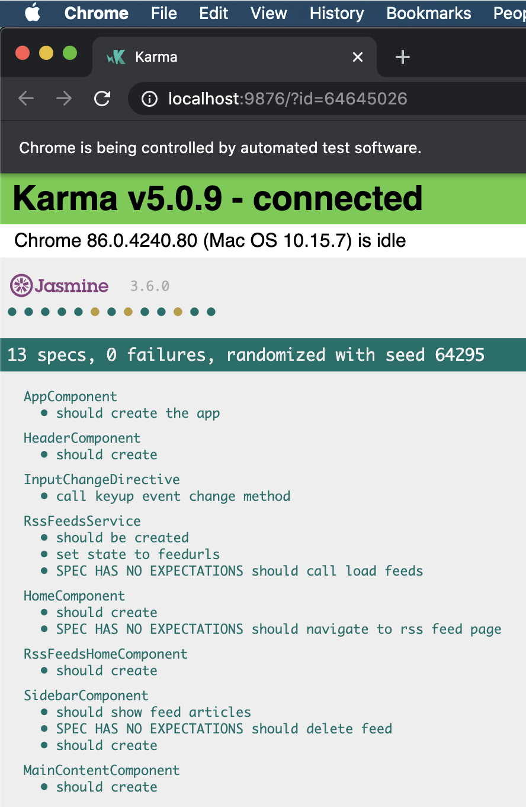

# RSS Tracker

This project is all about media monitoring. A lot of media currently is hosted online, and this project helps us detect when the media content changes, so that we can quickly react to it.

## Table of Contents

1. [Live Demo](#live-demo)
2. [Tech Used](#tech-used)
3. [Features Implemented](#features-implemented)
4. [Dev Setup](#dev-setup)
5. [Test Report](#test-report)
6. [Features not implemented](#features-not-implemented)

## Live Demo

1. Click [here](http://bgwebagency.in/projects/ui/rss-tracker/) to check the live Demo of the application.
2. Visit the [rss feed page](http://bgwebagency.in/projects/ui/rss-tracker/#/rss-feeds). It will show 2 feeds by default which are already being tracked by default.
    * SMH real time feed from: https://www.smh.com.au/rss/feed.xml and
    * Dummy feed from: `assets/mocks/mock.feed.json` to demonstrate real time update and delete of news.
3. Try adding NDTV feed: https://gadgets.ndtv.com/rss/polls/feeds to the list of feeds and on adding, the app will start tracking news from NDTV with checking of live updates for every 3 seconds.
4. You can remove the existing or new feeds from the list by clicking the trash icon.
5. List of working feeds: Copy paste the below URLs into search field to see
    * SMH Feed: https://www.smh.com.au/rss/feed.xml
    * NDTV Feed: https://gadgets.ndtv.com/rss/polls/feeds
    * Dummy Feed: `assets/mocks/mock.feed.json`
6. Note: For demo, many RSS feeds are not working because of CORS not being allowed for the APIs. And if any API could not be loaded: the App will show an error message.

## Tech Used
1. Angular v10.1.5 (Frontend Framework)
2. NgRx v10.0.1 (For state management)
3. RxJs v6.6.3 (For handling API calls)
4. Karma and Jasmine (For testing)

## Features Implemented
1. **Lazy Loading**: The [home page](http://bgwebagency.in/projects/ui/rss-tracker/) will load only the App module. And the [RSS Feed screen](http://bgwebagency.in/projects/ui/rss-tracker/#/rss-feeds) has been created using another module called rss-feeds. Thus making sure that the app loads faster on first load and load the rss-feeds module only on visiting rssfeeds screen.
2. **Live Update**: On [rss feed page](http://bgwebagency.in/projects/ui/rss-tracker/#/rss-feeds), all the added rss feeds will be tracked every 3 seconds to check if any new news has been deleted or added. And the deleted or added feed will be shown with an extra status text on top right corner.
3. **Performance Check**: The live update feature is implemented by hitting the APIs every 3 seconds. But the code is written to make sure that the DOM re-renders only if there is any new data in the API. If the data in API and store is same: then DOM is not re-rendered thus improving DOM performance.

## Dev Setup
1. Run `git clone https://github.com/kirandash/rss-tracker.git` to clone the project.
2. Run `npm install` to install all the dependencies.
3. Run `npm start` or `ng serve` for running the app on dev server. 
4. Navigate to `http://localhost:4200/`. The app will automatically reload if you change any of the source files.
5. **Test**: Run `npm test` or `ng test --code-coverage` to run unit tests with code coverage report via karma task runner.
6. **Build**: Run `ng build` to build the project. The build artifacts will be stored in the `dist/` directory. Use the `--prod` flag for a production build.

## Test Report
1. Unit tests are added to the project to achieve maximum coverage. Reports of which are added below:

    
     
    

## Features not implemented
1. Due to time limitation, the App has following limitations:
    * The application is not responsive. And styled only for desktop layout.
    * No validation added for checking if a valid URL is already present in the list. Therefore if we add the same URL twice, the App will not show any message to the user.
    * No button to trigger search. Now, user will have to enter the URL and press return to add the new feed for tracking. Which obviously will limit the functionality to only desktop users.
